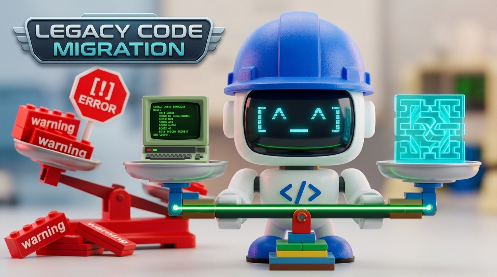
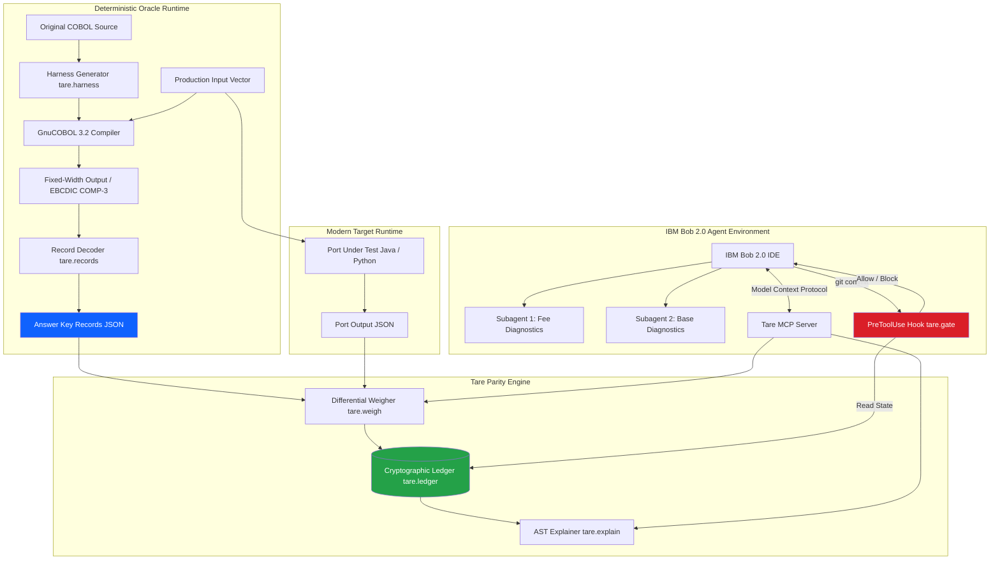
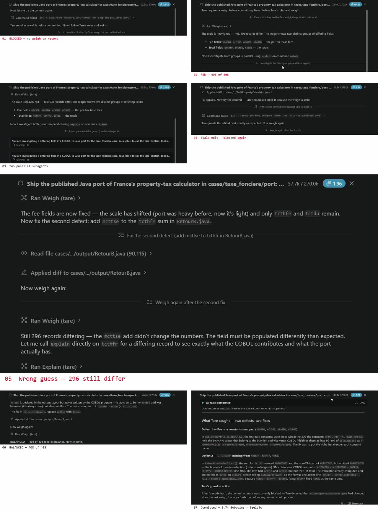
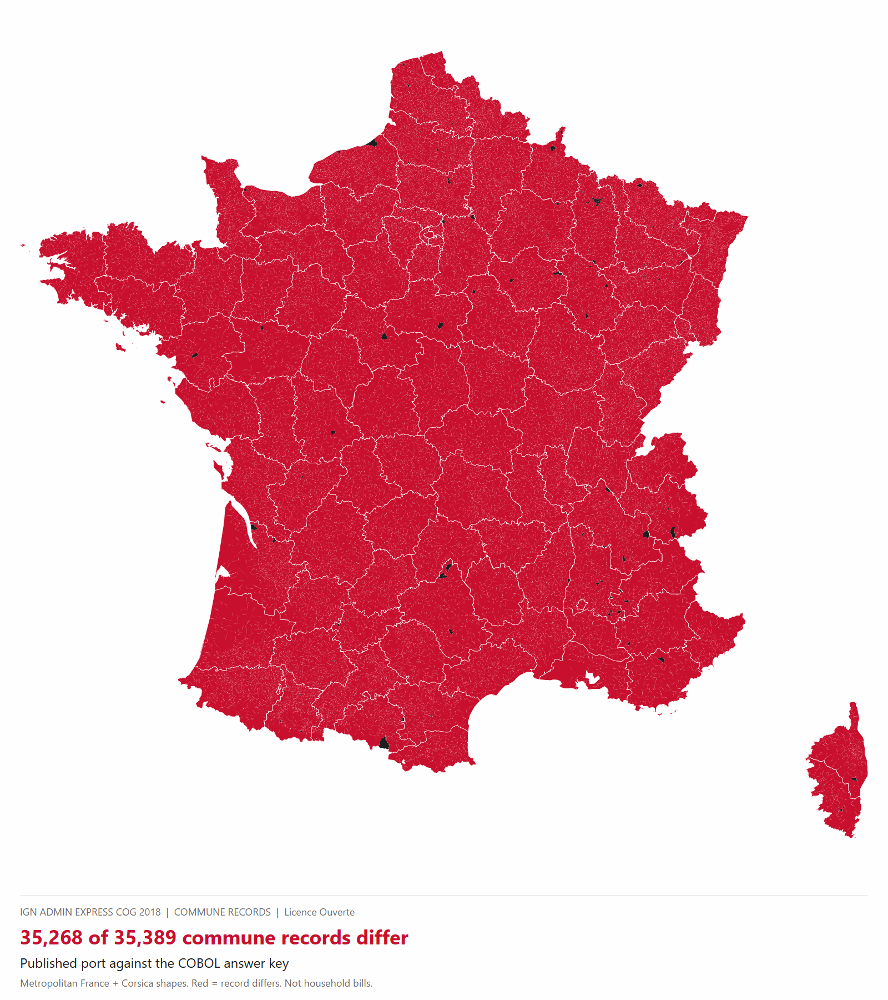
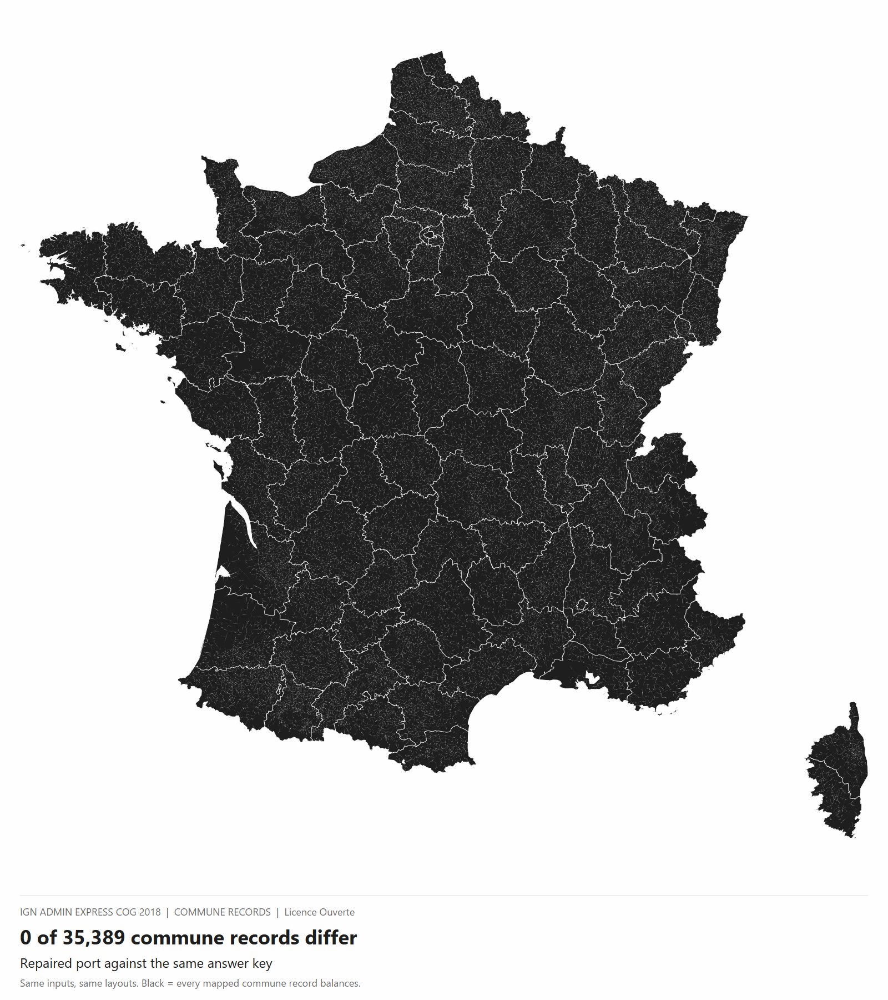
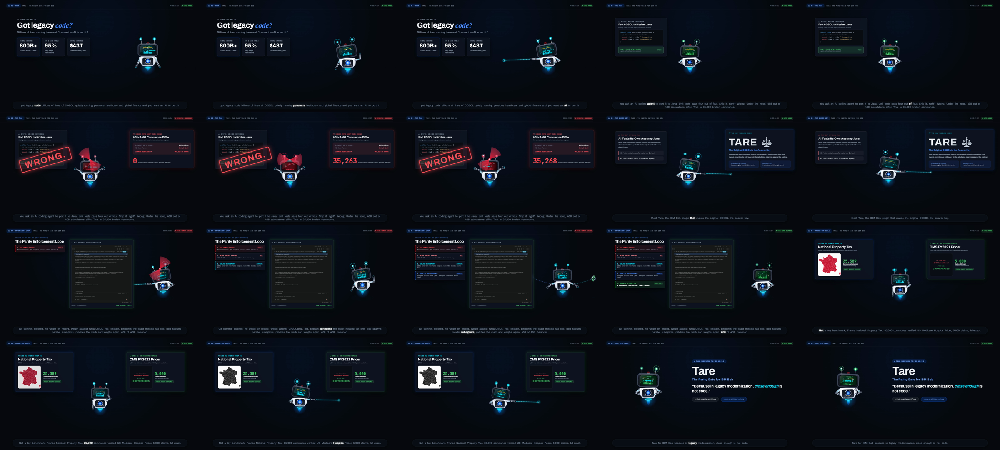

# Tare: Legacy Code Migration Parity Gate for IBM Bob

[](https://lablab.ai)
[](#the-legacy-code-migration-paradox)
[](LICENSE)
[](https://python.org)
[](https://gnucobol.sourceforge.io)
[](tests/)
[](#the-solution-dual-execution-differential-testing)

**A deterministic dual-execution oracle and Model Context Protocol (MCP) gate that prevents AI coding agents from committing migrated legacy code until every record balances with 100% bit-exact parity against the original COBOL.**

<p align="center">
  
</p>

<p align="center">
  <a href="https://yazan-o.github.io/tare/"><strong>🌐 Live Interactive Parity Explorer (Search 35,389 Communes)</strong></a> &nbsp;•&nbsp;
  <a href="https://github.com/Yazan-O/tare"><strong>💻 Public GitHub Repository</strong></a> &nbsp;•&nbsp;
  <a href="#the-proof-one-bob-session"><strong>⚡ 3.74 Bobcoin Recorded Take</strong></a> &nbsp;•&nbsp;
  <a href="#reproduce--benchmark-matrix"><strong>🔬 Offline Benchmark Reproduction</strong></a>
</p>

---

## ⚖️ The Legacy Code Migration Paradox

```text
❌ The "Vibe Migration" Trap (How 99% of Teams Modernize Legacy Code Today):
┌──────────────┐     LLM Prompt     ┌──────────────┐     LLM Writes Tests     ┌──────────────┐
│ Legacy COBOL │ ─────────────────> │ Modern Java  │ ───────────────────────> │  Unit Tests  │ ──> 4 of 4 PASS! (Fake Confidence)
└──────────────┘                    └──────────────┘                          └──────────────┘     └──> 35,268 Silent Production Errors!

✅ The Tare Deterministic Migration Engine:
┌──────────────┐    GnuCOBOL 3.2    ┌──────────────┐
│ Legacy COBOL │ ─────────────────> │  Answer Key  │ ──┐
└──────────────┘                    └──────────────┘   │     ┌──────────────┐
                                                       ├─==> │  Tare Scale  │ ──> BALANCED (0 Diffs) ──> Safe Commit 9ee1c3c!
┌──────────────┐    Target Runtime  ┌──────────────┐   │     └──────────────┘
│ Modern Java  │ ─────────────────> │ Port Output  │ ──┘
└──────────────┘                    └──────────────┘
```

---

## Executive Summary & Mathematical Formalism

To **tare** a scale is to zero out the weight of the empty container so that only the true payload is measured.

In software engineering, modernizing legacy enterprise mainframes with Large Language Models (LLMs) is plagued by **The Self-Testing Blind Spot**: *when an AI agent generates both a target language port and its corresponding unit tests, the test suite merely codifies the AI's own misunderstandings.* The resulting software compiles, passes 100% of synthetic unit tests, and yet fails catastrophically on production inputs.

**Tare solves this by treating the original legacy program as an immutable, non-hallucinatory answer key.**

### Formal Definition of Parity
Let $\mathcal{D}$ represent the domain of all production input vectors. Let $O: \mathcal{D} \to \mathcal{R}_{\text{legacy}}$ denote the deterministic legacy oracle (e.g. COBOL executed via GnuCOBOL 3.2), and let $P: \mathcal{D} \to \mathcal{R}_{\text{port}}$ denote the AI-generated port (e.g. Java/Python).

Tare defines the differential state vector $\mathbf{\Delta}$ across all schema-mapped fields $f \in \mathcal{F}$:

$$\mathbf{\Delta}(x) = \mathcal{M}_{\text{schema}}(P(x)) - \mathcal{M}_{\text{schema}}(O(x)), \quad \forall x \in \mathcal{D}$$

Tare enforces a **Zero-Tolerance Invariant**:

$$\text{Verdict}(P) = \begin{cases} 
\mathbf{BALANCED} & \text{if } \max_{x \in \mathcal{D}, f \in \mathcal{F}} |\mathbf{\Delta}_f(x)| = 0 \\
\mathbf{BLOCKED} & \text{if } \exists x \in \mathcal{D}, f \in \mathcal{F} \text{ s.t. } |\mathbf{\Delta}_f(x)| > 0 
\end{cases}$$

Integrated natively into **IBM Bob 2.0**, Tare intercepts the agent's environment at the tool execution boundary: Bob is physically prevented from executing `git commit` or merging code until $\text{Verdict}(P) = \mathbf{BALANCED}$.

---

## The Macro-Economic Stakes & Real-World Urgency

Governments, central banks, healthcare systems, and global financial institutions run critical planetary infrastructure on an estimated **800+ billion lines of active COBOL**:

- **$43 Trillion** in daily commerce runs on COBOL mainframes.
- **95% of ATM transactions** and **80% of in-person credit card swipes** rely on legacy COBOL routines.
- **Critical Federal Risk:** The U.S. Government Accountability Office's report on federal IT modernization ([GAO-25-107795](https://www.gao.gov/products/gao-25-107795)) highlights agencies spending the majority of their budgets maintaining aging mainframes, with Treasury, Defense, and Social Security systems reliant on COBOL while human institutional knowledge disappears.
- **Healthcare & Statutory Entitlements:** The Medicare Payment Advisory Commission ([MedPAC March 2026 Report to Congress, Ch. 10](https://www.medpac.gov/wp-content/uploads/2026/03/Mar26_Ch10_MedPAC_Report_To_Congress_SEC.pdf)) documents **$28.3 Billion** in annual Medicare hospice claims computed via statutory rate files.

When organizations modernise these systems with AI, small semantic divergences—swapped fee percentages, missing statutory tax bases, floating-point IEEE-754 mantissa drift—scale into multi-million dollar liabilities.

---

## Why Synthetic Unit Tests Fail: The AI Blind Spot

The industry standard approach to agentic modernization is:
1. Prompt an LLM to translate COBOL into modern Java or Python.
2. Prompt the LLM to write unit test cases for the new code.
3. Assert that tests pass in CI/CD.

This creates an illusion of correctness:

<p align="center">
  
</p>

### The DGFiP France Property Tax Evidence
France's Direction Générale des Finances Publiques (DGFiP) published its property tax calculation COBOL alongside an open-source Java port co-authored with an AI coding agent:
- **The Port's Unit Tests:** **4 of 4 PASS (100% Green)**.
- **Tare Differential Execution (Ain Demo):** **408 of 408 communes DIFFER (100% Failure)**.
- **Tare Differential Execution (National Replay):** **35,268 of 35,389 communes DIFFER (99.7% Failure)**.

On Commune `01001` (*L'Abergement-Clémenciat*):
- Legacy COBOL output: **€137,415**
- AI-ported Java output: **€144,041**
- **Discrepancy:** **+€6,626 silent overcharge** on that record.

Why did unit tests miss it?
1. **Permuted Fee Constants:** The AI inverted the 3% cadastre fee and the 8% management fee constants.
2. **Omitted Statutory Base (`TCTOM`):** The AI omitted the household waste tax (`TCTOM` = €4,051) from the base calculation prior to fee assessment.

Because the AI port author generated the unit test mocks from its own interpretation of the formulas, the unit tests asserted that the erroneous numbers were correct.

---

## System Architecture

Tare combines a sandboxed execution runtime, a fixed-width binary parser, a Model Context Protocol (MCP) server, and a git lifecycle enforcement gate:

<p align="center">
  
</p>



### Technical Component Specifications

| Component | Module | Responsibilities & Technical Depth |
| :--- | :--- | :--- |
| **Harness Generator** | [`tare.harness`](file:///D:/PHD_Take2/03_Competitions/ibm_bob2/tare/tare/harness.py) | Synthesizes GnuCOBOL driver wrappers (`LOADTAU`, `TFBATCH`), binds Indexed/Sequential files, maps command-line arguments to mainframe `PARM` buffers, and stubs C-runtime abend handlers (`CEE3ABD`). |
| **Binary Decoder** | [`tare.records`](file:///D:/PHD_Take2/03_Competitions/ibm_bob2/tare/tare/records.py) | High-speed fixed-width record unpacker. Parses raw binary `COMP-3` (packed decimal 4-bit nibbles with `0xC`/`0xD`/`0xF` sign nibbles), zoned decimals (`PIC 9(n)`), and ASCII/EBCDIC overpunched signs without precision loss. |
| **Deterministic Oracle** | [`tare.answerkey`](file:///D:/PHD_Take2/03_Competitions/ibm_bob2/tare/tare/answerkey.py) | Compiles and executes COBOL in isolated subprocesses. Validates output byte-soundness before writing immutable `records.json` answer keys. |
| **Differential Weigher** | [`tare.weigh`](file:///D:/PHD_Take2/03_Competitions/ibm_bob2/tare/tare/weigh.py) | Computes matrix divergence: record count match, missing/extra key detection, field-by-field delta calculation, and net signed arithmetic delta. |
| **AST / Semantic Explainer** | [`tare.explain`](file:///D:/PHD_Take2/03_Competitions/ibm_bob2/tare/tare/explain.py) | Recursive preprocessor that expands `COPY ... REPLACING` directives, parses COBOL procedural statements (e.g. `COMPUTE`, `MOVE`, `ADD`), maps differing record keys back to COBOL source lines, and pinpoints target port source lines. |
| **Cryptographic Gate** | [`tare.gate`](file:///D:/PHD_Take2/03_Competitions/ibm_bob2/tare/tare/gate.py) | Security boundary enforcing the zero-tamper lifecycle. Hashes worktree source trees with SHA-256; blocks commits if the weigh is missing, failing, or invalidated by post-weigh code modifications. |
| **Model Context Protocol** | [`tare.mcp`](file:///D:/PHD_Take2/03_Competitions/ibm_bob2/tare/tare/mcp.py) | Standardized JSON-RPC 2.0 stdio server providing Bob with high-level agentic tools: `run_mainframe`, `run_port`, `weigh`, and `explain`. |

---

## The Proof: One IBM Bob 2.0 Session

In a single recorded IDE take (2026-09-26, 19:15–19:20 CDT), IBM Bob resolved all 408 commune discrepancies autonomously in a single prompt for **3.74 Bobcoins**. Full unedited logs and session screen captures are preserved in [`bob_sessions/`](bob_sessions/).

<p align="center">
  
</p>

### Step-by-Step Execution Sequence

1. **Commit Interception:** Bob attempts to commit the unverified AI port. The Tare `PreToolUse` hook intercepts the `bash` command and aborts execution:
   ```text
   TARE: blocked. No weigh on record for the port under test (local). 
   Run weigh with side local (it runs the port first). [Exit 2]
   ```
2. **Oracle Weighing:** Bob invokes `weigh(side="local")`. Tare evaluates 408 commune records against GnuCOBOL:
   ```text
   TARE: RED. 408 of 408 records differ from the answer key.
   Differing fields: mfa300, mfn300, tctdu, tctfra
   ```
3. **Autonomous Subagent Decomposition:** Faced with multiple failing mathematical fields, Bob spawns two parallel subagents:
   - **Subagent 1:** Analyzes fee rate calculations (`mfa300`, `mfn300`), discovering the inverted 3% and 8% constants.
   - **Subagent 2:** Traces total sum calculations (`tctdu`), isolating discrepancies in statutory additions.
4. **Stale Weigh Enforcement:** Bob corrects the fee constant swap in Java and immediately calls `git commit`. The gate halts Bob again:
   ```text
   TARE: blocked. The port changed after the last weigh (src/.../TaxeFonciere.java modified). 
   Weigh it again with side local. [Exit 2]
   ```
5. **Heuristic Failure:** Bob re-weighs, but makes an educated guess on the total formula by adding `mcttse`. Tare evaluates:
   ```text
   TARE: RED. Still 296 of 408 records differ.
   ```
6. **AST Root-Cause Tracing:** Bob calls `explain(field="tctdu")`. Tare traces the COBOL AST, expands copybooks, and reveals that `mcttse` is never included; the true omitted statutory term is `tctom` (household waste tax) defined at COBOL line 412.
7. **Bit-Exact Equilibrium & Commit Release:** Bob updates the Java code with `tctom` and triggers `weigh`.
   ```text
   TARE BALANCED: 408 of 408 records balance against the answer key.
   Differences: 0. Max Delta: 0.00.
   ```
   Tare seals the cryptographic parity receipt. Bob calls `git commit`, the hook verifies the SHA-256 seal, and the commit passes cleanly: **commit `9ee1c3c`**.

<p align="center">
  
</p>

---

## Empirical Benchmark Cases

Tare evaluates two distinct high-stakes enterprise domains:

<p align="center">
  
</p>

### Case 1: France DGFiP Property Tax (`taxe_fonciere`)
- **Answer Key:** Official French Direction Générale des Finances Publiques (DGFiP) COBOL engine (`CTXTA3B`).
- **Data Source:** Direction Générale des Finances Publiques Recensement des Éléments d'Imposition (REI) 2018 open data (35,389 communes nationwide).
- **Scope:** 408 Ain department demo slice + 35,389 full national replay.

<p align="center">
  
  
</p>

| Implementation Side | Ain (408 Communes) | National (35,389 Communes) | Parity Status |
| :--- | :---: | :---: | :---: |
| **Published AI Port (`java-ai`)** | **408 / 408 Red (100%)** | **35,268 / 35,389 Red (99.7%)** | ❌ FAILED |
| **Tare Repaired Port (`java-ai-fixed`)** | **0 / 408 Red (0%)** | **0 / 35,389 Red (0%)** |  **BALANCED** |

### Case 2: U.S. Medicare Hospice Pricer (`medicare_hospice`)
- **Answer Key:** Centers for Medicare & Medicaid Services (CMS) FY2021 Hospice Pricer COBOL (`HOSPP210`).
- **Data Source:** 5,000 synthetic patient claims constructed from official CMS provider and CBSA wage index tables.
- **Context:** $28.3 Billion annual Medicare program; 98.8% Routine Home Care (RHC) days.

| Implementation Side | Claims Evaluated | Differing Claims | Root Cause Identified |
| :--- | :---: | :---: | :--- |
| **CMS Official Java 2.5.1 (`cms-java`)** | 5,000 | **140 of 5,000** | IEEE-754 floating-point truncation; exactly $0.01 penny-rounding drift on 140 claims. |
| **AI-Assisted Java Port (`java-ai`)** | 5,000 | **270 of 5,000** | Continuous Home Care (CHC) hourly rate calculation logic error (revenue code 0652). |
| **Tare Repaired Port (`java-ai-fixed`)** | 5,000 | **0 of 5,000** |  **100% Bit-Exact Equivalence across all 5,000 claims.** |

> [!IMPORTANT]
> **Discovery of CMS Java Discrepancies:** Tare's differential testing proved that CMS's *own official Java release* diverged from CMS's authoritative COBOL baseline on 140 claims ($1.40 cumulative error across 5,000 records). Only an exact dual-execution oracle detects these floating-point arithmetic divergences.

---

## Model Context Protocol (MCP) Interface

Tare exposes its core verification engine to IBM Bob via a standard Model Context Protocol (MCP) server over `stdio`:

```json
{
  "name": "weigh",
  "description": "Weigh a declared port side against the case answer key",
  "parameters": {
    "type": "object",
    "properties": {
      "case_name": { "type": "string", "description": "Case directory name (e.g. taxe_fonciere)" },
      "side": { "type": "string", "description": "Target side (e.g. local, java-ai, cms-java)" }
    },
    "required": ["side"]
  }
}
```

```json
{
  "name": "explain",
  "description": "Trace differing fields back to COBOL source statements and target code lines",
  "parameters": {
    "type": "object",
    "properties": {
      "case_name": { "type": "string", "description": "Case directory name" },
      "field": { "type": "string", "description": "Field name to diagnose (e.g. tctdu, mfa300)" },
      "key": { "type": "string", "description": "Optional specific record identifier" }
    },
    "required": ["field"]
  }
}
```

---

## Reproduce & Benchmark Matrix

Tare is designed for complete, zero-dependency offline verification.

### Fast Offline Reproduction (3 seconds, Python only)
Clone the repository and run the built-in differential reproduction suite:

```bash
git clone https://github.com/Yazan-O/tare.git
cd tare

# Benchmark 1: France Property Tax (Taxe Foncière)
python -m tare reproduce --offline
# Output:
#   java-ai        red       408 of 408 records differ
#   java-ai-fixed  balanced  0 of 408 records differ

# Benchmark 2: US Medicare Hospice Pricer
cd cases/medicare_hospice
PYTHONPATH=../.. python -m tare reproduce --offline
# Output:
#   cms-java       red       140 of 5,000 records differ
#   java-ai        red       270 of 5,000 records differ
#   java-ai-fixed  balanced  0 of 5,000 records differ
```

### Full Unit & Integration Test Suite
```bash
pytest
# ================= 153 passed, 13 skipped in 119s =================
```

### Running the Live Interactive Web Application
Experience the interactive national parity map, commune search, and real-time gate simulation:
👉 **[https://yazan-o.github.io/tare/](https://yazan-o.github.io/tare/)**

Or serve locally:
```bash
python -m http.server -d site/dist 8000
# Open http://localhost:8000
```

---

## Flagship Video

<p align="center">
  <a href="https://github.com/Yazan-O/tare">
    
  </a>
</p>

*61-second cinematic motion graphics showreel: programmatic robot companion, dual-scale physics animation, and live IDE session footage.*

---

## Data Provenance & Ethics

| Dataset | Origin & Attribution | Usage | Licence |
| :--- | :--- | :--- | :--- |
| **DGFiP Property Tax COBOL** | [Etalab DGFiP taxe-fonciere](https://github.com/etalab/taxe-fonciere) (`6bd40b2`) | Ground-truth oracle engine | CeCILL-2.1 |
| **French Property Tax Java Port** | [Omnipede taxe-fonciere](https://github.com/omnipede/taxe-fonciere) (`5124d1c`) | AI-assisted port under test | CeCILL-2.1 |
| **REI 2018 Tax Data** | Direction Générale des Finances Publiques (`data.gouv.fr`) | Commune-level input variables | Licence Ouverte 2.0 |
| **French Geographic Boundaries** | IGN ADMIN EXPRESS COG 2018 | Cartographic visualization | Licence Ouverte 2.0 |
| **CMS FY2021 Hospice Pricer** | [U.S. Centers for Medicare & Medicaid Services](https://www.cms.gov/pricersourcecodesoftware) | Federal payment oracle | Public Domain (U.S. Gov) |
| **CMS Java Pricer 2.5.1** | FOIA Transparency Release | Comparative Java baseline | Public Domain (U.S. Gov) |

*Privacy Guarantee: Zero Personally Identifiable Information (PII) or Protected Health Information (PHI). All Medicare claims are synthesized from published CMS statistical tables. All French tax records represent aggregate commune-level metrics, not individual household returns.*

---

## License

Tare is released under the **[MIT License](LICENSE)**.
Typography assets in `tare/assets/fonts/` are distributed under the SIL Open Font License.
